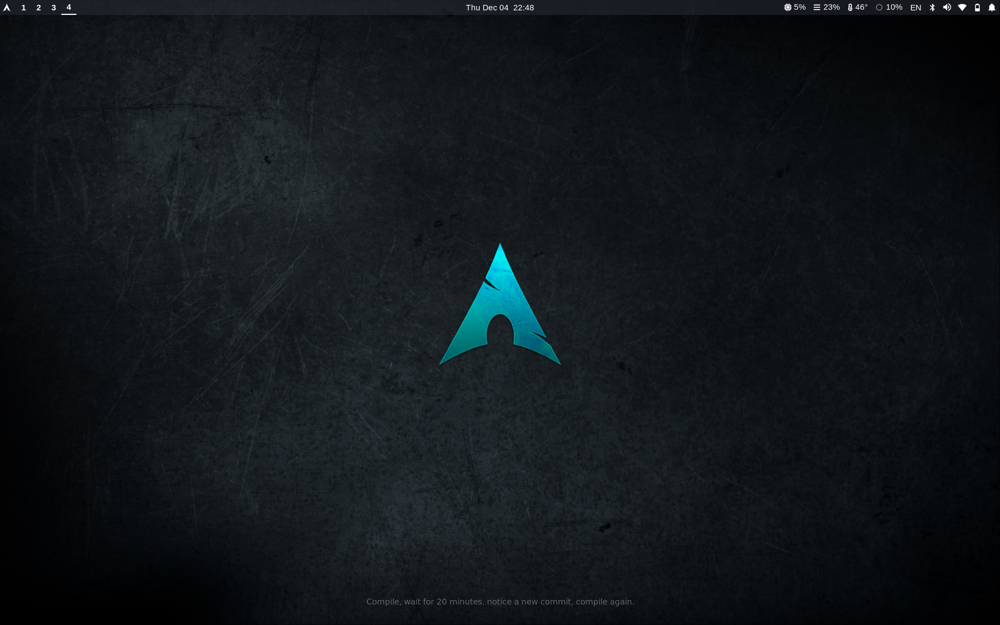

# Hyprland Dotfiles on Arch Linux

This repository contains my personal dotfiles and setup instructions for Hyprland on Arch Linux, including Waybar, Wofi, and other utilities.

Its workspace looks like this:

<p align="center">
  
</p>

Next, there is a simple instruction to set up a complete Arch Linux with Hyprland. Keep in mind that some packages might be specific to my system. So you need to find and install ones which are compatible to your system. 


## Install Packages

### Basic Arch Linux packages
```
sudo pacman -S base base-devel linux linux-firmware sof-firmware intel-ucode intel-media-driver mesa sudo git nano vi man-db man-pages texinfo tlp bluez bluez-utils
```


### Hyprland and config-related packages
```
sudo pacman -S hyprland hyprpaper hypridle hyprpolkitagent xdg-desktop-portal-hyprland waybar wofi swaync alacritty ttf-firacode-nerd pavucontrol brightnessctl blueberry networkmanager upower grim slurp wl-clipboard libnotify fzf udiskie
```


### Optional packages for a complete setup
```
sudo pacman -S qt5-wayland qt6-wayland firefox mpv zathura zathura-pdf-mupdf pass feh superfile ttf-dejavu ttf-liberation adw-gtk-theme timeshift
```

## Scripts permissions
### Give execution permissions to scripts
```
chmod +x .config/waybar/scripts/*
```


## Systemd services

### Enable these systemd services
```
sudo systemctl enable --now tlp.service
sudo systemctl enable --now bluetooth.service
```

## Cloning this repository
After cloning this repository, you have to link these config folders to your config folders in your system so that they work as expected.
For example:
```
ln -sf ~/dotfiles/.config/waybar ~/.config/waybar
```

## Wi-Fi setup

### To add a wifi connection which has username and password

1. Search for available wifis:
```
nmcli device wifi list
```

2. If the security of the wifi you want is WPA2 802.1X:
```
nmcli connection add \
  type wifi ifname wlp0s20f3 con-name "<SSID>" ssid "<SSID>" \
  wifi.hidden yes \
  wifi-sec.key-mgmt wpa-eap \
  802-1x.eap peap \
  802-1x.identity "<YOUR_USERNAME>" \
  802-1x.password "<YOUR_PASSWORD>" \
  802-1x.phase2-auth mschapv2 \
  connection.autoconnect yes
nmcli connection up "<YOUR_USERNAME>" --ask
```

## Password manager
We use pass which is a simple password manager for the command line (https://wiki.archlinux.org/title/Pass)

### Create a GPG key (use RSA with 4096 bits)
```
gpg --full-generate-key
```

You can see the already created keys with this:
```
gpg -k
```

### To initialize the password store:

```
pass init gpg-id_or_email
```

### To create a new password, first provide a descriptive hierarchical name.

```
pass insert archlinux.org/wiki/username
```

### To get a view of the password store do the following.

```
pass
```

output:
```
Password Store
└── archlinux.org
    └── wiki
        └── username
```

### To retrieve a single password:

```
pass [-c] archlinux.org/wiki/username
```

Or simply by my script, use this command and choose password:

```
passc
```

### To generate a new random password do this, where n is the desired password length as a number:

```
pass generate archlinux.org/wiki/username n
```

### To delete a password
```
pass delete archlinux.org/wiki/username
```

Or simply by my script, use this command and choose password:
```
passd
```

### To edit a password:
```
pass edit archlinux.org/wiki/username
```


## Timeshift - create snapshots (in ext4 hard disk format)

After setting up everything, create a snapshot of your system with Timeshift so that if in the future you face any breaks in your system, you can easily revert to previous versions.

### Listing snapshots:

```
sudo timeshift --list
```

### Creating a snapshot:

```
sudo timeshift --create --comments "comment"
```

### Restoring a snapshot:

```
sudo timeshift --restore --snapshot "snapshot"
```

### Deleting a snapshot:

```
sudo timeshift --delete --snapshot "snapshot"
```

To create snapshot of Btrfs filesystems or getting more info, visit this link: https://wiki.archlinux.org/title/Timeshift


## Mount and unmount USBs and external hard disks

Hyprland by default does not support automatic mounting and unmounting external devices like USBs. To make mounting automatic, use this in hyprland.conf:

```
exec-once = udiskie
```

To unmount a disk and detach it so that you can safely remove it:

```
lsblk
udiskie-umount --detach /run/media/<username><external_usb_name>
```

To manually mount a device if it fails:
```
lsblk
udiskie-mount /dev/sda1
```

More info: https://man.archlinux.org/man/extra/udiskie/udiskie.8.en


## Bluetooth
We use this command to enter bluetooth controller:
```
bluetoothctl
```

Then you can use these commands there to find and connect to a bluetooth:
```
[bluetooth]# default-agent
Default agent request successful

[bluetooth]# power on
Changing power on succeeded
[CHG] Controller 00:10:20:30:40:50 Powered: yes

[bluetooth]# scan on
Discovery started
[CHG] Controller 00:10:20:30:40:50 Discovering: yes
[NEW] Device 00:12:34:56:78:90 device name
[CHG] Device 00:12:34:56:78:90 LegacyPairing: yes

[bluetooth]# pair 00:12:34:56:78:90
Attempting to pair with 00:12:34:56:78:90
[CHG] Device 00:12:34:56:78:90 Connected: yes
[CHG] Device 00:12:34:56:78:90 Connected: no
[CHG] Device 00:12:34:56:78:90 Connected: yes
Request PIN code
[agent] Enter PIN code: 1234
[CHG] Device 00:12:34:56:78:90 Paired: yes
Pairing successful
[CHG] Device 00:12:34:56:78:90 Connected: no

[bluetooth]# connect 00:12:34:56:78:90
Attempting to connect to 00:12:34:56:78:90
[CHG] Device 00:12:34:56:78:90 Connected: yes
Connection successful
```