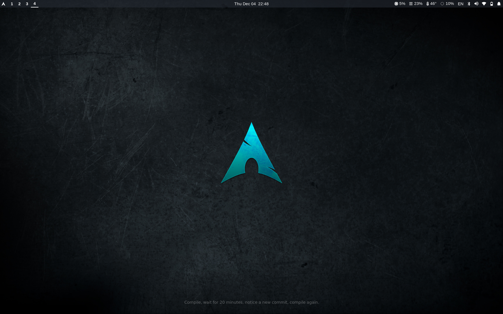

# Hyprland Dotfiles on Arch Linux

This repository contains my personal dotfiles and setup instructions for Hyprland on Arch Linux, including Waybar, Wofi, and other utilities.

Its workspace looks like this:

<p align="center">
  
</p>

Next, there is a simple instruction to set up a complete Arch Linux with Hyprland. Keep in mind that some packages might be specific to my system. So you need to find and install ones which are compatible to your system. 


## Install Packages

### Basic Arch Linux packages
```
sudo pacman -S base base-devel linux linux-firmware linux-headers sof-firmware intel-ucode intel-media-driver mesa sudo git openssh nano vi pipewire pipewire-alsa pipewire-pulse man-db man-pages texinfo tlp bluez bluez-utils
```


### Hyprland and config-related packages
```
sudo pacman -S hyprland hyprpaper hypridle hyprlock hyprpolkitagent xdg-desktop-portal-hyprland waybar wofi swaync alacritty ttf-firacode-nerd noto-fonts-emoji pavucontrol brightnessctl networkmanager upower grim slurp wl-clipboard libnotify fzf udiskie jq neovim tree-sitter-cli ripgrep fd tree-sitter-cli
```


### Optional packages for a complete setup
```
sudo pacman -S qt5-wayland qt6-wayland firefox mpv zathura zathura-pdf-mupdf pass feh superfile ttf-dejavu ttf-liberation adw-gtk-theme timeshift zip unzip sshuttle
```

## Scripts permissions
### Give execution permissions to scripts
```
chmod +x .config/waybar/scripts/*
chmod +x .config/hypr/scripts/*
```


## Systemd services

### Enable these systemd services
```
sudo systemctl enable --now tlp.service
sudo systemctl enable --now bluetooth.service
```

## Cloning this repository
After cloning this repository, you have to link these config folders to your config folders in your system so that they work as expected.
For example:
```
ln -sf ~/dotfiles/.config/waybar ~/.config/waybar
```

## Weather in waybar
To be able to use weather in waybar, create a .env file in your home directory (if not already existed) and add these lines based on your current location there so that it fetches your weather data.
```
LATITUDE=12.1234
LONGITUDE=12.1234
```

## Install yay
To work with aur packages, you can use yay.
```
git clone https://aur.archlinux.org/yay.git
cd yay
makepkg -si
```

## somke apps need yay
```
yay -S blueberry
```

## Wi-Fi setup

### To add a wifi connection which has username and password

1. Search for available wifis:
```
nmcli device wifi list
```

2. If the security of the wifi you want is WPA2 802.1X:
```
nmcli connection add \
  type wifi ifname wlp0s20f3 con-name "<SSID>" ssid "<SSID>" \
  wifi.hidden yes \
  wifi-sec.key-mgmt wpa-eap \
  802-1x.eap peap \
  802-1x.identity "<YOUR_USERNAME>" \
  802-1x.password "<YOUR_PASSWORD>" \
  802-1x.phase2-auth mschapv2 \
  connection.autoconnect yes
nmcli connection up "<YOUR_USERNAME>" --ask
```

3. If you just wanna connect to a network:
```
nmcli device wifi connect "<SSID>" --ask
```

## Password manager
We use pass which is a simple password manager for the command line (https://wiki.archlinux.org/title/Pass)

### Create a GPG key (use RSA with 4096 bits)
```
gpg --full-generate-key
```

You can see the already created keys with this:
```
gpg -k
```

### To initialize the password store:

```
pass init gpg-id_or_email
```

### To create a new password, first provide a descriptive hierarchical name.

```
pass insert archlinux.org/wiki/username
```

### To get a view of the password store do the following.

```
pass
```

output:
```
Password Store
└── archlinux.org
    └── wiki
        └── username
```

### To retrieve a single password:

```
pass [-c] archlinux.org/wiki/username
```

Or simply by my script, use this command and choose password:

```
passc
```

### To generate a new random password do this, where n is the desired password length as a number:

```
pass generate archlinux.org/wiki/username n
```

### To delete a password
```
pass delete archlinux.org/wiki/username
```

Or simply by my script, use this command and choose password:
```
passd
```

### To edit a password:
```
pass edit archlinux.org/wiki/username
```


## Timeshift - create snapshots (in ext4 hard disk format)

After setting up everything, create a snapshot of your system with Timeshift so that if in the future you face any breaks in your system, you can easily revert to previous versions.

### Listing snapshots:

```
sudo timeshift --list
```

### Creating a snapshot:

```
sudo timeshift --create --comments "comment"
```

### Restoring a snapshot:

```
sudo timeshift --restore --snapshot "snapshot"
```

### Deleting a snapshot:

```
sudo timeshift --delete --snapshot "snapshot"
```

To create snapshot of Btrfs filesystems or getting more info, visit this link: https://wiki.archlinux.org/title/Timeshift


## Mount and unmount USBs and external hard disks

Hyprland by default does not support automatic mounting and unmounting external devices like USBs. To make mounting automatic, use this in hyprland.conf:

```
exec-once = udiskie
```

To unmount a disk and detach it so that you can safely remove it:

```
lsblk
udiskie-umount --detach /run/media/<username><external_usb_name>
```

To manually mount a device if it fails:
```
lsblk
udiskie-mount /dev/sda1
```

More info: https://man.archlinux.org/man/extra/udiskie/udiskie.8.en


## Bluetooth
We use this command to enter bluetooth controller:
```
bluetoothctl
```

Then you can use these commands there to find and connect to a bluetooth:
```
[bluetooth]# default-agent
Default agent request successful

[bluetooth]# power on
Changing power on succeeded
[CHG] Controller 00:10:20:30:40:50 Powered: yes

[bluetooth]# scan on
Discovery started
[CHG] Controller 00:10:20:30:40:50 Discovering: yes
[NEW] Device 00:12:34:56:78:90 device name
[CHG] Device 00:12:34:56:78:90 LegacyPairing: yes

[bluetooth]# pair 00:12:34:56:78:90
Attempting to pair with 00:12:34:56:78:90
[CHG] Device 00:12:34:56:78:90 Connected: yes
[CHG] Device 00:12:34:56:78:90 Connected: no
[CHG] Device 00:12:34:56:78:90 Connected: yes
Request PIN code
[agent] Enter PIN code: 1234
[CHG] Device 00:12:34:56:78:90 Paired: yes
Pairing successful
[CHG] Device 00:12:34:56:78:90 Connected: no

[bluetooth]# connect 00:12:34:56:78:90
Attempting to connect to 00:12:34:56:78:90
[CHG] Device 00:12:34:56:78:90 Connected: yes
Connection successful
```

## TLP
This is a power management tool for linux. Its configurations can be found in /etc/tlp.conf
To change configurations, you need to change them there. For example:
```
START_CHARGE_THRESH_BAT0=70
STOP_CHARGE_THRESH_BAT0=80
```
These configurations set the maximum charging of 80% to the battery and the battery will start to charge again if it reaches below 70%. To see if these min and max configurations are taking place, run this command:
```
sudo tlp-stat -b
```


## BTRFS file systems with LUKS disk encryption
If you want to encrypt your disk while installing Arch linux and use BTRFS with multiple subvolumes, use this:

When you are partitioning your disk, do it this way:
```
cfdisk /dev/nvme0n1
```
And create 2 volumes. One with 1GB for boot and the other partition for the rest.

Then:
```
cryptsetup luksFormat /dev/nvme0n1p2
cryptsetup open /dev/nvme0n1p2 cryptroot

mkfs.fat -F 32 /dev/nvme0n1p1
mkfs.btrfs -L ARCH_ROOT /dev/mapper/cryptroot

mount /dev/mapper/cryptroot /mnt

btrfs subvolume create /mnt/@
btrfs subvolume create /mnt/@home
btrfs subvolume create /mnt/@snapshots
btrfs subvolume create /mnt/@swap

umount /mnt

mount -o subvol=@,compress=zstd /dev/mapper/cryptroot /mnt
mkdir -p /mnt/{home,.snapshots,boot,swap}
mount -o subvol=@home,compress=zstd /dev/mapper/cryptroot /mnt/home
mount -o subvol=@snapshots,compress=zstd /dev/mapper/cryptroot /mnt/.snapshots
mount -o subvol=@swap /dev/mapper/cryptroot /mnt/swap
mount /dev/nvme0n1p1 /mnt/boot

btrfs filesystem mkswapfile --size 72G /mnt/swap/swapfile
swapon /mnt/swap/swapfile
```

To enable hibenation, first you'll need to run this line:
```
btrfs inspect-internal map-swapfile -r /swap/swapfile
```

It will give you a number. Save or remember it for later

After this, the rest of installation is the same until you wanna run mkinitcpio -P. Before running that:

```
nano /etc/mkinitcpio.conf
```
Look for a line like this:
```
HOOKS=(base systemd autodetect microcode modconf kms keyboard block sd-encrypt filesystems fsck)
```
Add sd-vconsole to it:
```
HOOKS=(base systemd autodetect microcode modconf kms keyboard sd-vconsole block sd-encrypt filesystems fsck)
```
Then run this command:
```
mkinitcpio -P
```

Finally when you wanna edit arch.conf file, first get the UUID of LUKS encrypted part:
```
cryptsetup luksUUID /dev/nvme0n1p2
```

Then with it and with the number we got from swap part before, arch.conf should be like this:
```
title   Arch Linux
linux   /vmlinuz-linux
initrd  /initramfs-linux.img
options rd.luks.name=<LUKS_UUID>>=cryptroot root=/dev/mapper/cryptroot rootflags=subvol=@ resume=/dev/mapper/cryptroot resume_offset=<swap_number> rw
```

# Tuxedo laptops:
In Tuxedo laptops, do not install tlp or power-profile-daemon. Install this instead and enable it:
```
yay -S tuxedo-drivers-dkms tuxedo-control-center-bin
```

Also install these in Nvidia GPUs:
```
sudo pacman -S nvidia-open nvidia-prime nvidia-utils
```

# System files (`etc/` and `usr/`)
The `etc/` and `usr/` folders mirror paths under `/`. They hold system-wide fixes for my TUXEDO laptop (Intel iGPU + NVIDIA RTX 5060 dGPU, Thunderbolt dock, Bluetooth keyboard/mouse). Unlike `.config/`, **do not symlink them**. They are read by root, by udev and by the initramfs, often before `/home` is mounted (and `/home` may be encrypted). Copy them with the right owner and permissions instead.

| File | What it does |
|------|--------------|
| `etc/modprobe.d/nvidia.conf` | Lets the dGPU power down when idle (`NVreg_DynamicPowerManagement=0x02`) and blocks `nvidia_modeset`/`nvidia_drm`. Those modules register a bogus `nvidia_0` backlight after resume, which deadlocks resume. `nvidia` and `nvidia_uvm` (CUDA) still load. |
| `etc/modprobe.d/nvidia-utils.conf` | Replaces `/usr/lib/modprobe.d/nvidia-utils.conf` (same name wins) to remove `nvidia-drm` from the softdep. |
| `etc/udev/rules.d/61-gpu-names.rules` | Creates stable `/dev/dri/igpu` and `/dev/dri/dgpu` symlinks. `.bash_profile` uses them to set `AQ_DRM_DEVICES` for Hyprland. |
| `etc/udev/rules.d/80-nvidia-pm.rules` | Enables runtime power management on the NVIDIA PCI device, so the dGPU can suspend. |
| `etc/udev/rules.d/90-bluetooth-wakeup.rules` | Lets the Bluetooth keyboard/mouse wake the laptop from suspend (enables USB wakeup on the Intel BT adapter and its root hub). |
| `etc/systemd/sleep.conf.d/hibernate.conf` | Powers off completely after hibernating, so USB/dock events cannot wake the laptop from S4. |
| `usr/lib/systemd/system-sleep/thunderbolt-reset` | After hibernation, re-probes the Thunderbolt controller so the dock monitors come back (same as re-plugging the dock). |

Tradeoffs of blocking `nvidia_drm`:
- Monitors wired to the dGPU's own ports do not work (monitors on the dock/iGPU do).
- `prime-run` cannot present Vulkan/OpenGL windows. CUDA still works.
- To undo it, delete the two `install ... /bin/false` lines from `nvidia.conf` and run `mkinitcpio -P`.

### Adapt to your hardware first
Some files hard-code PCI addresses and USB IDs from my laptop. Check yours:
```
lspci -D | grep -Ei 'vga|3d|thunderbolt'
lsusb | grep -i bluetooth
```
- `61-gpu-names.rules`: `0000:00:02.0` (iGPU) and `0000:02:00.0` (dGPU)
- `thunderbolt-reset`: `0000:00:0d.2` (Thunderbolt controller)
- `90-bluetooth-wakeup.rules`: `8087:0033` (Intel Bluetooth adapter)
- `.bash_profile` also has `pci-0000:00:02.0` and `MESA_VK_DEVICE_SELECT=8086:7d67` (iGPU vendor:device, see `lspci -nn`)

Skip the NVIDIA files on machines without an NVIDIA GPU. The `.bash_profile` block only runs when `/dev/dri/igpu` exists, so the same dotfiles work on machines that don't have these files.

### Install
```
cd ~/dotfiles
sudo install -Dm644 -t /etc/modprobe.d etc/modprobe.d/*.conf
sudo install -Dm644 -t /etc/udev/rules.d etc/udev/rules.d/*.rules
sudo install -Dm644 -t /etc/systemd/sleep.conf.d etc/systemd/sleep.conf.d/hibernate.conf
sudo install -Dm755 -t /usr/lib/systemd/system-sleep usr/lib/systemd/system-sleep/thunderbolt-reset
```

### Apply
The `modconf` hook copies `/etc/modprobe.d` into the initramfs, so rebuild it and reboot:
```
sudo mkinitcpio -P
sudo reboot
```
If only a udev rule or the sleep settings changed, you do not need to reboot:
```
sudo udevadm control --reload
sudo udevadm trigger
```
`sleep.conf.d` and the `system-sleep` hook are read each time the laptop suspends or hibernates, so they need nothing extra.

### Check that it works
```
lsmod | grep -E '^nvidia_(drm|modeset)'                      # prints nothing
cat /sys/bus/pci/devices/0000:02:00.0/power/runtime_status   # suspended (when idle)
ls -l /dev/dri/igpu                                          # symlink exists
systemd-analyze cat-config systemd/sleep.conf | grep HibernateMode
```

### After updates
- After an `nvidia-utils` update, compare the packaged file with the override and copy any new lines into `etc/modprobe.d/nvidia-utils.conf`:
  ```
  diff /usr/lib/modprobe.d/nvidia-utils.conf /etc/modprobe.d/nvidia-utils.conf
  ```
- To see whether the installed files still match the repo:
  ```
  for f in $(find etc usr -type f); do diff -q "$f" "/$f"; done
  ```

# Camera in Linux
If camera in Linux is not having good quality, you can install this and change settings:
```
sudo pacman -S v4l-utils
v4l2-ctl --list-ctrls
v4l2-ctl --set-ctrl=brightness=20
```

Overall, the setting which works for me is this:
```
User Controls

                     brightness 0x00980900 (int)    : min=-64 max=64 step=1 default=0 value=20 flags=has-min-max
                       contrast 0x00980901 (int)    : min=0 max=100 step=1 default=50 value=45 flags=has-min-max
                     saturation 0x00980902 (int)    : min=0 max=100 step=1 default=64 value=64 flags=has-min-max
                            hue 0x00980903 (int)    : min=-180 max=180 step=1 default=0 value=0 flags=has-min-max
        white_balance_automatic 0x0098090c (bool)   : default=1 value=0
                          gamma 0x00980910 (int)    : min=100 max=500 step=1 default=300 value=300 flags=has-min-max
                           gain 0x00980913 (int)    : min=0 max=128 step=1 default=64 value=64 flags=has-min-max
           power_line_frequency 0x00980918 (menu)   : min=0 max=2 default=2 value=2 (60 Hz)
      white_balance_temperature 0x0098091a (int)    : min=2800 max=6500 step=10 default=4600 value=5000 flags=has-min-max
                      sharpness 0x0098091b (int)    : min=0 max=100 step=1 default=50 value=50 flags=has-min-max
         backlight_compensation 0x0098091c (int)    : min=0 max=2 step=1 default=0 value=2 flags=has-min-max
   region_of_interest_rectangle 0x00981ae1 (rect)   : value=(0,0)/1x1 flags=has-payload, has-min-max
  region_of_interest_auto_ctrls 0x00981ae2 (bitmask): max=0x00000001 default=0x00000001 value=0x00000000 flags=has-min-max

Camera Controls

                  auto_exposure 0x009a0901 (menu)   : min=0 max=3 default=3 value=3 (Aperture Priority Mode)
         exposure_time_absolute 0x009a0902 (int)    : min=50 max=4500 step=1 default=166 value=166 flags=inactive, has-min-max
     exposure_dynamic_framerate 0x009a0903 (bool)   : default=0 value=1
```
